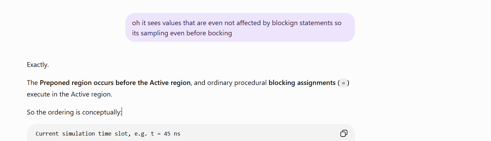

# SystemVerilog Realizations

This file records the ideas that personally **clicked while studying**. It is deliberately separate from the formal lesson notes:

- **Learning notes** explain what SystemVerilog defines and how to use it.
- **Realizations** record the mental connection that makes the behavior intuitive.

Each entry keeps the original evidence, states the realization clearly, and then verifies why it is correct.

## Index

| No. | Realization |
|---:|---|
| 01 | [Concurrent assertions sample before same-edge blocking assignments](#01--concurrent-assertions-sample-before-same-edge-blocking-assignments) |
| 02 | [`$rose` reports a sampled transition; it does not return the sample](#02--rose-reports-a-sampled-transition-it-does-not-return-the-sample) |

## 01 — Concurrent assertions sample before same-edge blocking assignments

### The realization

> A concurrent assertion can see a value that is not affected by a blocking assignment made at the same clock edge. Therefore, its value must have been sampled before that blocking assignment executed.

That reasoning is correct for ordinary static design signals used by a concurrent assertion.

### Why it happens

A clock edge creates one simulation time slot containing several ordered regions. The important ordering is:

~~~text
PREPONED  ->  ACTIVE  ->  NBA  ->  OBSERVED  ->  REACTIVE
   |             |                    |              |
   |             |                    |              +-- run assertion action
   |             |                    +-- evaluate the property
   |             +-- execute ordinary procedural blocking assignments
   +-- obtain ordinary concurrent-assertion samples
~~~

Suppose a positive edge occurs at `t = 45 ns`:

| Region | What happens | Meaning |
|---|---|---|
| **Preponed** | The concurrent assertion obtains its sample of an ordinary signal such as `a`. | The sample represents `a` immediately before the current time slot's procedural activity. |
| **Active** | An `always @(posedge clk)` block executes `a = 1'b1;`. | The blocking assignment changes the current value immediately, but it is too late to alter the sample already taken for this assertion attempt. |
| **Observed** | The concurrent property is evaluated. | It uses the earlier sampled value of `a`, not a fresh read of the value written in Active. |
| **Reactive** | The assertion's pass or fail action executes. | A plain `a` read here can show the newer current value, while `$sampled(a)` shows the value that caused the assertion decision. |

All four stages can occur at `t = 45 ns`. No simulation time needs to pass between them.

### Minimal example

~~~systemverilog
logic clk = 1'b0;
logic a   = 1'b0;

always #5 clk = ~clk;

always @(posedge clk) begin
  a = 1'b1;  // Blocking assignment executes in Active.
end

a_was_low_at_the_edge: assert property (@(posedge clk) !a)
  $info("PASS: sampled a=%0b, current a=%0b", $sampled(a), a);
else
  $error("FAIL: sampled a=%0b, current a=%0b", $sampled(a), a);
~~~

At the first positive edge:

1. Preponed supplies sampled `a = 0`.
2. Active executes the blocking assignment, so current `a` becomes `1`.
3. Observed evaluates `!a` using sampled `a = 0`, so the property passes.
4. Reactive runs the pass action. It can report `sampled a=0` and `current a=1`.

The result may initially look contradictory, but the two printed values answer different questions:

- `$sampled(a)` asks, “Which value did this assertion attempt use?”
- plain `a` in the Reactive action asks, “What is the signal's current value now?”

### The boundary of this realization

The safe memory rule is:

> Ordinary concurrent-assertion operands normally use their Preponed samples, while ordinary procedural blocking assignments normally execute later in Active.

Do not overgeneralize it into “every assertion-related expression is always sampled in Preponed.” SystemVerilog defines qualifications for clock expressions, `disable iff`, automatic or local variables, checker variables, and clocking-block inputs. The realization describes the common ordinary-static-signal case shown in the screenshot.

### One-line recall test

If a same-edge Active blocking assignment changes `a`, which value explains a concurrent assertion's decision: plain `a` in the Reactive action or `$sampled(a)`?

**Answer:** `$sampled(a)`, because it retrieves the sample used by the assertion attempt.

For the complete scheduler explanation, see [Event Scheduling Regions and Assertion Types](SV%20Assertions/Foundations/00-event-scheduling-regions-and-assertion-types/README.md).

## 02 — `$rose` reports a sampled transition; it does not return the sample

### The realization

> `$rose(a)` uses the assertion's sampled values, but it does not give me the Preponed value of `a`. It returns a Boolean result telling me whether the sampled least-significant bit rose between the previous and current sampling events.

This resolves two statements that sound similar but mean different things:

- **Does `$rose(a)` look at values sampled for the assertion?** Yes.
- **Does `$rose(a)` return the current sampled value?** No. It returns the result of a transition test.

### What `$sampled` and `$rose` return

~~~text
$sampled(a)  -> current sampled value of a

$rose(a)     -> Boolean transition result:
                did sampled LSB(a) move from 0/X/Z to 1?
~~~

For a one-bit known signal, the essential table is:

| Previous sampled `a` | Current sampled `a` | `$rose(a)` |
|---:|---:|---:|
| 0 | 0 | 0 |
| 0 | 1 | 1 |
| 1 | 0 | 0 |
| 1 | 1 | 0 |

SystemVerilog also recognizes `X → 1` and `Z → 1` as rises. That is why the precise rule is broader than only `0 → 1`. If an unknown-to-known transition must instead be considered illegal, add a separate `$isunknown` check; `$rose` alone does not prove that the earlier value was known.

### The two samples used by `$rose`

~~~text
previous assertion clock                 current assertion clock
sampled LSB(a) = 0                       sampled LSB(a) = 1
          |                                        |
          +--------------- compare ----------------+
                                                   |
                                              $rose(a) = 1
~~~

“Previous” and “current” refer to sampling events in the function's clocking context. They do not mean two arbitrary procedural reads taken before and after an assignment in one Active-region block.

For a property clocked by `@(posedge clk)`, the conceptual flow at the current edge is:

~~~text
Preponed : obtain the current assertion sample of a
Active   : RTL/testbench procedural code may update the current live a
NBA      : nonblocking-assignment updates may commit
Observed : evaluate the concurrent property, including $rose(a),
           from the stored sampled history
Reactive : execute the assertion's pass/fail action block
~~~

The comparison needs history from the preceding relevant sampling event as well as the current Preponed sample. Active or NBA updates occurring later in the current time slot cannot rewrite the sample already used by this assertion attempt.

### Worked examples

If the two positive-edge samples are:

~~~text
previous posedge: a = 0
current  posedge: a = 1
~~~

then:

~~~systemverilog
$sampled(a)  // returns 1
$rose(a)     // returns 1 because 0 -> 1 occurred
~~~

If the samples are instead:

~~~text
previous posedge: a = 1
current  posedge: a = 1
~~~

then:

~~~systemverilog
$sampled(a)  // still returns 1
$rose(a)     // returns 0 because no rise occurred
~~~

This second example proves why the two functions are not interchangeable: the current sampled value can be `1` even though `$rose(a)` is `0`.

### The sampled-value function family

| Function | Question answered |
|---|---|
| `$sampled(a)` | What is the current sampled value of `a`? |
| `$rose(a)` | Did the sampled least-significant bit rise to `1`? |
| `$fell(a)` | Did the sampled least-significant bit fall to `0`? |
| `$stable(a)` | Is the complete current sampled expression equal to its previous sample? |
| `$changed(a)` | Is the complete current sampled expression different from its previous sample? |
| `$past(a)` | What value was sampled at an earlier clocking event? |

`$rose` and `$fell` inspect only the expression's least-significant bit. For a vector, `$rose(bus)` does not mean that any bit in the bus rose. If the requirement concerns the entire vector, compare current and past vector samples explicitly.

For example, a mask of all bits that changed from `0` to `1` is:

~~~systemverilog
(~$past(bus)) & bus
~~~

and a Boolean test for at least one known binary rising bit can be written as a reduction over that mask, together with whatever unknown-value policy the design requires.

### First-sample caution

At the first clocking event there is no actual previous simulation sample for this clocking context. Sampled-value functions use their language-defined default history. Therefore, do not describe a first-tick `$rose` result as proof that a hardware transition was observed before simulation began. Reset gating or a history-valid flag is useful when the first comparison must be ignored.

### One-line recall test

If `$sampled(a)==1`, must `$rose(a)==1`?

**Answer:** No. `$sampled(a)==1` tells you the current sample. `$rose(a)==1` additionally requires the preceding sample's least-significant bit to have been `0`, `X`, or `Z`.

For executable examples, continue with [Part 07 — Current and Sampled Values](SV%20Assertions/Codes/07-current-and-sampled-values/README.md) and [Part 09 — `$fell` and Sampled Transitions](SV%20Assertions/Codes/09-fell-and-sampled-transitions/README.md).

### Reference

- [Accellera — SystemVerilog Assertions Tutorial 2016](https://www.accellera.org/images/resources/videos/SystemVerilog_Assertions_Tutorial_2016.pdf)
- [IEEE Std 1800-2023 — active SystemVerilog standard](https://standards.ieee.org/ieee/1800/7743/)
