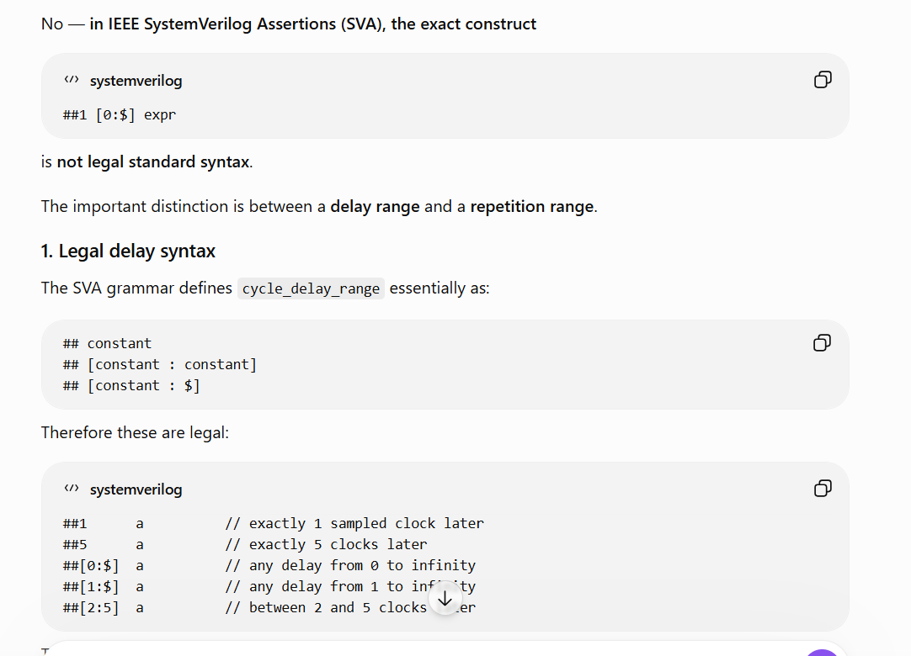

# Part 19 — Sequence `and`, Property `not`, and `strong`

[← Part 18](../18-sequence-or-operator/README.md) · [SV Assertions index](../README.md) · [Part 20 →](../20-throughout-within-and-intersect/README.md)

| Playground field | Value |
|---|---|
| EDA Playground Name | Blank in the captured browser field |
| Stable playground | [Gg3J](https://edaplayground.com/x/Gg3J) |
| EDA code ID | `7374092` |
| Simulator | Siemens Questa 2025.2 |
| Compile / run options | `-timescale 1ns/1ns` / `-voptargs=+acc=npr` |
| Verified live result | 0 compile and assertion errors; `a1` passes at 55 ns after starting at 25 ns; VCD task-order warning |
| Open EPWave after run | Disabled |

Two Edge tabs pointed to this same stable short ID. They were deduplicated into this one repository part. The design pane is placeholder-only, and the browser Name field is blank.

## Exact browser source

~~~systemverilog
// to make the assertion a2 strong 

module tb;
 reg clk = 0,rd,wr,start;
 
 always #5 clk = ~clk;
 
 
 
 
 
 initial begin
 start = 0;
 #20;
 start = 1;
 #10;
 start = 0;
 end

 //write  
 initial begin
 wr = 0;
 #30;
 wr = 1;
 #10;
 wr = 0;
 end
 //read 
 initial begin
 rd = 0;
 #40;
 rd = 1;
 #20;
 rd = 0;
 end

 sequence seqwrite;
   wr[*1]; // single repetition of write, 
 endsequence
 
 
 
 sequence seqread;
   ##1 rd[*2]; // 1 clock tick delay and 2 repetitions of read 
 endsequence
 
 sequence seqwriteandread;
   (##[0:$] wr && rd) ;  // o to infinite delay but strong wr and read both should be high : its showing error in strong 
   
 endsequence
  a1: assert property (@(posedge clk) $rose(start) |=> seqread and seqwrite) $info("write and read "); 
    // read and write operation do now occur at the same time 
    
    a2: assert property (@(posedge clk) $rose(start) |=> not strong(seqwriteandread)) $info("read and write, not high at the same time"); 
initial begin
 $dumpvars;
 $dumpfile("dump.vcd");
 $assertvacuousoff(0);
 #110;
 $finish;
 end
endmodule
~~~

Local source: [testbench.sv](testbench.sv).

## How sequence `and` aligns its operands

`seqread and seqwrite` starts both operands on the same consequent start. Both must match, but they may finish on different samples; the compound `and` match completes at the later endpoint.

The antecedent `$rose(start)` is sampled at 25 ns. Because `a1` uses nonoverlapped implication `|=>`, the consequent starts one clock later at 35 ns.

~~~text
sample             25 ns      35 ns      45 ns      55 ns
$rose(start)          1
consequent start                  ^
seqwrite = wr[*1]                 1          -> finishes at 35 ns
seqread = ##1 rd[*2]                         1          1
seqread and seqwrite                                      -> finishes at 55 ns
~~~

This matches the verified log: `a1` starts at 25 ns and prints “write and read” at 55 ns. `and` does **not** require both operands to finish together. It requires a common start and a successful match of both operands.

## Why this is not simultaneous read and write

The `seqwrite` match occurs at 35 ns, while `seqread` matches at 45 and 55 ns. Therefore `seqread and seqwrite` proves that both timed sequences complete from the same attempt; it does not prove `wr && rd` on one clock.

For a simultaneous one-sample rule, use a Boolean expression:

~~~systemverilog
assert property (@(posedge clk) $rose(start) |=> wr && rd);
~~~

For independent timing from a common start, the original sequence `and` is the appropriate operator.

## Understanding `not strong(seqwriteandread)`

The third sequence contains an unbounded search:

~~~systemverilog
sequence seqwriteandread;
  ##[0:$] (wr && rd);
endsequence
~~~

The source's parentheses are equivalent in intent: after any finite number of clock delays, find a sample on which both `wr` and `rd` are true. `strong(seqwriteandread)` requires that a finite match actually be found; an infinite search with no match cannot silently pass at the end.

### Q&A — Why is `##1 [0:$] expr` illegal?

The screenshot records the syntax issue discussed for this playground. These two forms do **not** mean the same thing:

~~~systemverilog
##[0:$] expr    // legal: one ranged cycle-delay operator
##1 [0:$] expr  // illegal: exact ##1, then a bare [0:$]
~~~

In the legal form, `[0:$]` is the range belonging directly to `##`: wait anywhere from zero clocks to an unbounded finite number of clocks, then try `expr`. In the illegal form, `##1` is already a complete exact-delay operator. The following bare `[0:$]` is not a sequence expression and is not legal repetition syntax, so the parser has nothing to attach it to.

If the intention is an exact one-clock delay followed by zero-or-more consecutive repetitions of `expr`, the repetition operator must include `*` and follow the expression:

~~~systemverilog
##1 expr[*0:$]
~~~

Whitespace is not the deciding issue. `## [0:$] expr` is still a ranged delay, because whitespace does not separate `##` from its bracketed range in the grammar. The illegal construct is specifically an already-complete exact delay (`##1`) followed by an unattached bare range. The archived source uses the correct ranged-delay form:

~~~systemverilog
##[0:$] (wr && rd)
~~~

The property then negates that eventual-match requirement:

~~~systemverilog
not strong(seqwriteandread)
~~~

This is difficult to use as a practical “never simultaneous” checker because any finite prefix can still be followed by a future `wr && rd` sample. The negative claim cannot be established early while the unbounded future remains open. In the verified run, Questa reports no `a2` failure, but it also prints no `a2` pass message before `$finish`. Absence of an error is therefore not useful finite pass evidence for the intended safety rule.

A bounded version gives the simulator a definite endpoint. For example, to forbid simultaneous read/write for eight consequent samples:

~~~systemverilog
assert property (@(posedge clk)
  $rose(start) |=> (!(wr && rd))[*8]
);
~~~

In a real protocol, replace the arbitrary count with a finite transaction-ending condition and check `!(wr && rd)` throughout that window.

## The verified warning is unrelated to SVA

The source calls `$dumpvars` before `$dumpfile`:

~~~systemverilog
$dumpvars;
$dumpfile("dump.vcd");
~~~

Questa warns that `$dumpfile` should be called first and ignores the late filename request. The archived source remains exact. The conventional order is:

~~~systemverilog
$dumpfile("dump.vcd");
$dumpvars;
~~~

The live “Open EPWave after run” checkbox was disabled, so no waveform window was requested automatically.

## Revision checks

1. When does the consequent of `|=>` begin relative to the antecedent?
2. Why can `seqwrite` finish at 35 ns while the `and` expression finishes at 55 ns?
3. Does sequence `and` mean that `wr` and `rd` are simultaneously true?
4. Why can an unbounded “never eventually” statement not produce an early finite pass?
5. What finite-window property would better express the actual exclusion rule?
6. Why must `$dumpfile` precede `$dumpvars`?

## References

- [IEEE Std 1800-2023 — active SystemVerilog standard](https://standards.ieee.org/ieee/1800/7743/)
- [IEEE Std 1800-2017 SystemVerilog LRM](https://rfsoc.mit.edu/6S965/_static/F24/documentation/1800-2017.pdf) — Clause 16, Assertions
- [Accellera SystemVerilog Assertions tutorial](https://www.accellera.org/resources/videos/systemverilog-assertions-tutorial-2016)
