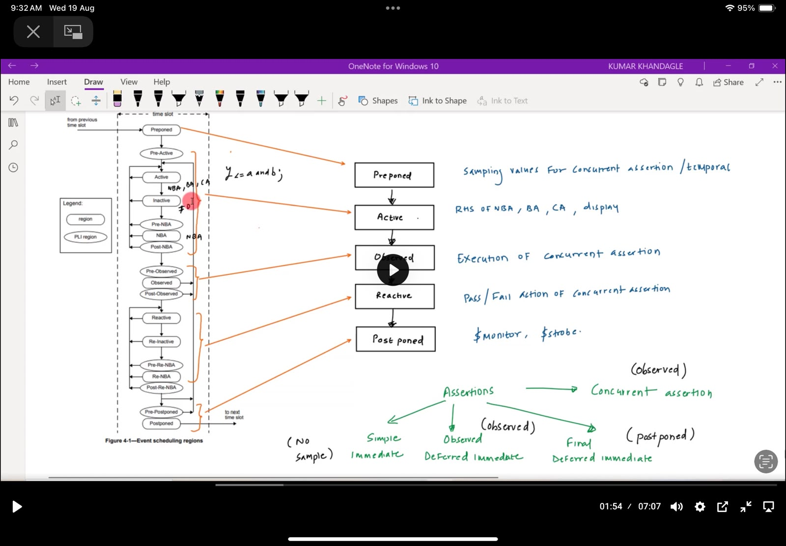
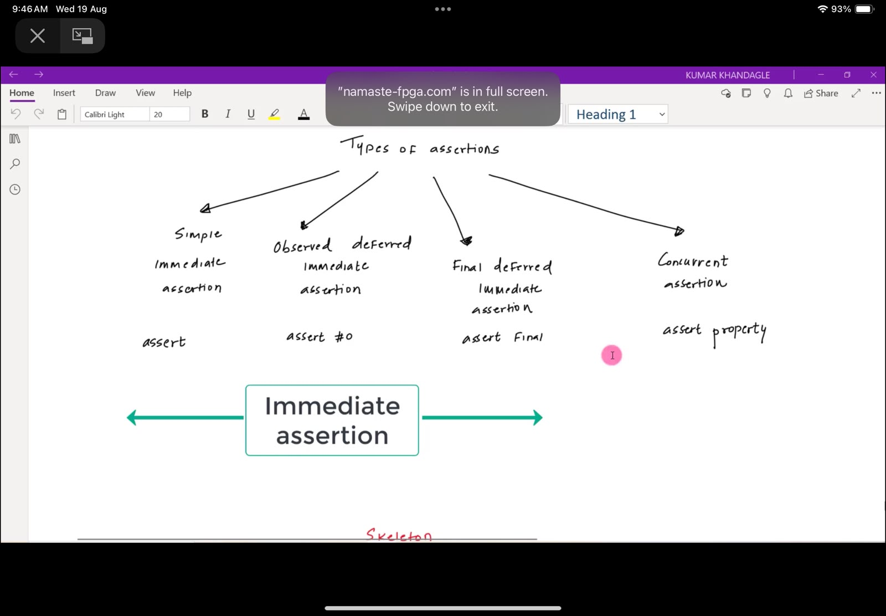
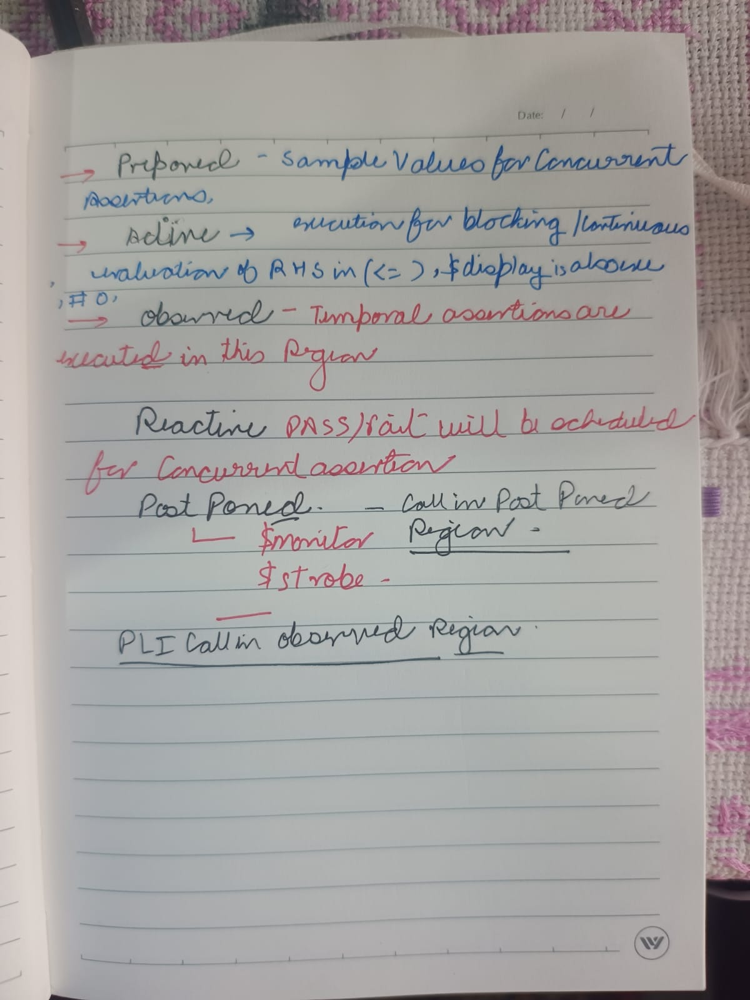

# Foundation 00 — Event Scheduling Regions and Assertion Types

[SV Assertions home](../../README.md) · [Foundations index](../README.md) · [Ordered browser-playground lessons](../../Codes/README.md) · [Illustrative source](examples.sv)

> This is a source-checked foundation note, not a saved EDA Playground lesson. The numbered browser-written assertion sequence still begins at Part 01.

SystemVerilog does not perform every operation at a timestamp in one indivisible step. It divides each simulation time slot into ordered event regions. That ordering answers questions such as:

- Does an assertion see a signal before or after a nonblocking assignment?
- Why can <code>$display</code> and <code>$strobe</code> print different values at the same simulation time?
- Why does a concurrent assertion sample in one region, evaluate in another, and report in another?
- Why can two procedural blocks race even though the simulator reports the same timestamp for both?
- What is actually deferred by <code>assert #0</code> and <code>assert final</code>?

The lecture screenshots compress the scheduler into five memorable stages—Preponed, Active, Observed, Reactive, and Postponed. That is a useful learning map, but the IEEE scheduler contains 17 ordered regions. This note first explains the compressed map, then expands every region and connects it to the four assertion forms shown in the lecture.

## Study map

| Section | Main question |
|---|---|
| [The scheduler vocabulary](#1-the-scheduler-vocabulary) | What are an event, time slot, region, iteration, and race? |
| [Screenshot 1: scheduler and assertion map](#2-screenshot-1-scheduler-and-assertion-map) | How should the large region diagram be read? |
| [All 17 regions](#3-all-17-event-regions) | What does every named region mean? |
| [The five-region assertion pipeline](#4-the-five-region-assertion-pipeline) | Why are Preponed, Active, Observed, Reactive, and Postponed emphasized? |
| [Screenshot 2: assertion families](#5-screenshot-2-the-correct-assertion-family-tree) | How are simple, deferred, and concurrent assertions related? |
| [Immediate assertions](#6-immediate-assertions-in-depth) | What is evaluated immediately, and where? |
| [Deferred immediate assertions](#7-deferred-immediate-assertions-in-depth) | What is actually deferred, and how are glitches suppressed? |
| [Concurrent assertions](#8-concurrent-assertions-in-depth) | How do sampling, temporal evaluation, and action blocks interact? |
| [Screenshot 3: handwritten notes](#9-screenshot-3-line-by-line-confirmation-and-corrections) | Which handwritten statements are exact, and which need qualification? |
| [Tasks, reporting, and sampled-value functions](#10-system-tasks-reporting-and-sampled-value-functions) | Where do common tasks run, when do they print, and which version of a value do they use? |
| [Worked time-slot trace](#11-worked-time-slot-trace) | What happens region by region at one clock edge? |
| [Examples and pitfalls](#12-practical-examples) | How do these ideas appear in real code? |

## 1. The scheduler vocabulary

Before memorizing region names, separate five concepts that are often mixed together.

### 1.1 Simulation time

Simulation time is the timestamp reported by <code>$time</code>, such as 10 ns. Time advances only when the simulator moves to a later nonempty time slot. Processing another event region does not advance simulation time.

Therefore, all of the following can happen at 10 ns:

1. a clock transition occurs;
2. edge-sensitive procedural blocks wake up;
3. nonblocking-assignment right-hand sides are evaluated;
4. nonblocking-assignment left-hand sides are updated;
5. concurrent properties are evaluated;
6. assertion pass/fail code runs;
7. <code>$strobe</code> prints the final values.

They share one timestamp but do not happen in one scheduler phase.

### 1.2 Event

An event is scheduled work. The work can update a net or variable, or evaluate a process that may schedule more work. A signal update can awaken several sensitive processes, and those processes can produce further updates. The simulator continues until the current time slot has no remaining executable work.

### 1.3 Time slot

A time slot is all scheduled activity at one simulation time. The scheduler must empty the relevant region queues for that timestamp before advancing to the next timestamp.

### 1.4 Event region

An event region is an ordered queue or scheduling phase within a time slot. Regions create deterministic boundaries between categories of work. They do not guarantee a source-code order between unrelated processes placed in the same region.

This distinction is central:

- Active is guaranteed to occur before NBA.
- NBA is guaranteed to occur before Observed.
- Two unrelated processes both running in Active can still execute in either order.

### 1.5 Scheduler iteration and “delta cycle”

Some regions are iterative. Work performed later in the time slot can schedule more work into an earlier iterative set, so the simulator loops without advancing time. Engineers often call such zero-time passes delta cycles, although “delta cycle” is informal terminology rather than one of the 17 SystemVerilog region names.

### 1.6 Race condition

A race exists when legal scheduler orderings can produce different observable results. Regions prevent some classes of races by defining boundaries, but they do not make arbitrary same-region code deterministic.

For example, if two <code>always @(posedge clk)</code> blocks both use blocking assignments and one reads what the other writes, both normally run in Active. Their relative order is not guaranteed, so the result can depend on which process the simulator selects first.

## 2. Screenshot 1: scheduler and assertion map

The left side reproduces the IEEE event scheduling ladder. The center simplifies it into:

~~~text
Preponed -> Active -> Observed -> Reactive -> Postponed
~~~

The simplification is useful specifically for assertions:

1. **Preponed — sample.** Concurrent assertions obtain the stable sampled values associated with the clock tick.
2. **Active — execute design and ordinary module procedural work.** Blocking assignments execute, continuous-assignment processes react, nonblocking-assignment right-hand sides are evaluated, and NBA updates are scheduled.
3. **Observed — judge.** Triggered concurrent property expressions are evaluated from their sampled values.
4. **Reactive — react.** Concurrent-assertion pass/fail action blocks are executed.
5. **Postponed — observe the final settled slot.** Tasks such as <code>$strobe</code> and <code>$monitor</code>, and matured final-deferred reports, see the end-of-slot state.

A strong memory sentence is:

> Sample before design activity, let the design settle, judge the sampled property, react to the result, then perform final read-only reporting.

That sentence is intentionally about concurrent assertions. Immediate assertions follow procedural execution rules and require a separate explanation.

## 3. All 17 event regions

IEEE 1800-2017 Clause 4.4 orders the regions as follows. The current IEEE 1800-2023 revision remains the active SystemVerilog standard; the 2017 wording is used here because it matches Figure 4-1 visible in the lecture.

| Order | Region | Kind | Precise purpose and practical meaning |
|---:|---|---|---|
| 1 | **Preponed** | Simulation, with a read-only PLI hook | Provides the value immediately before activity in the current time slot. Most static variables referenced by concurrent assertions use this region’s value as their sampled value. It runs once per time slot and cannot be re-entered during iterative settling. Sampling here is equivalent to the preceding time slot’s final Postponed value. |
| 2 | **Pre-Active** | PLI callback control point | Allows PLI applications to read or write values and create events immediately before Active work. Ordinary SystemVerilog source code is not placed here merely because it appears before an <code>always</code> block. |
| 3 | **Active** | Simulation | Holds ordinary active design events. Module <code>initial</code> and <code>always</code> procedures normally resume here; blocking assignments update immediately in their executing process; continuous assignments and primitives evaluate or update here; a nonblocking assignment normally evaluates its RHS here and schedules its LHS update for NBA. Events in this region may be processed in any order across independent processes. |
| 4 | **Inactive** | Simulation | Holds a process suspended by an explicit procedural <code>#0</code> while executing in the active region set. After Active empties, Inactive events are promoted for another Active iteration. It is not the meaning of the <code>#0</code> token in <code>assert #0</code>. |
| 5 | **Pre-NBA** | PLI callback control point | Allows a PLI application to inspect or affect the simulation immediately before NBA updates. |
| 6 | **NBA** | Simulation | Applies nonblocking-assignment LHS updates that were scheduled from the active region set. The RHS value was captured earlier when the NBA statement executed; NBA is where that captured value reaches the destination. |
| 7 | **Post-NBA** | PLI callback control point | Gives PLI code a boundary after NBA updates and before properties are evaluated. |
| 8 | **Pre-Observed** | Read-only PLI callback control point | Lets PLI code read the state after the active region set has stabilized but before property evaluation. The standard forbids writing values or scheduling current-slot events from this region. |
| 9 | **Observed** | Simulation | Evaluates triggered concurrent property expressions. It uses sampled assertion values, not a fresh late read of ordinary signals. Concurrent pass/fail action code is scheduled into Reactive. PLI callbacks are not allowed inside Observed itself. Observed-deferred immediate reports also mature at this stage. |
| 10 | **Post-Observed** | PLI callback control point | Provides a read boundary after property evaluation. It separates judging a property from running the property’s action block. |
| 11 | **Reactive** | Simulation | Executes program-block and checker reactive work and concurrent-assertion action blocks. It is the reactive-set counterpart of Active. An observed-deferred immediate assertion’s matured action call also runs here. |
| 12 | **Re-Inactive** | Simulation | Holds an explicit procedural <code>#0</code> encountered while executing in the reactive region set. It is the reactive counterpart of Inactive. |
| 13 | **Pre-Re-NBA** | PLI callback control point | Gives PLI code a boundary before reactive-set nonblocking updates. |
| 14 | **Re-NBA** | Simulation | Applies nonblocking-assignment updates scheduled from the reactive region set, analogous to NBA for the active region set. |
| 15 | **Post-Re-NBA** | PLI callback control point | Gives PLI code a boundary after Re-NBA. Reactive activity can create further iterations before the slot becomes final. |
| 16 | **Pre-Postponed** | PLI callback control point | Runs after the other iterative regions have drained and immediately before Postponed. If permitted work creates more iterative activity, the scheduler must settle that work before finally entering Postponed. |
| 17 | **Postponed** | Simulation and final read-only PLI work | Contains <code>$monitor</code>, <code>$strobe</code>, similar final-observation events, and matured final-deferred assertion actions. No new value changes may occur once Postponed is reached; code here cannot write a net or variable or schedule work back into an earlier current-slot region. |

### 3.1 Simulation regions versus PLI boundary regions

The narrow regions in the screenshot are mainly control points for the Programming Language Interface. They let simulator extensions observe or influence execution at carefully defined boundaries.

This does **not** mean “PLI runs in Observed.” The opposite is important: the standard explicitly disallows PLI callbacks in Observed. PLI has Pre-Observed and Post-Observed callback boundaries around property evaluation.

A DPI function called directly from SystemVerilog is also not automatically scheduled in one of these PLI callback queues. A synchronous imported function call executes as part of the SystemVerilog process that called it. PLI callback scheduling and an ordinary DPI call are different concepts.

### 3.2 Active and reactive region sets

The scheduler has two mirrored groups:

- **Active set:** Active, Inactive, Pre-NBA, NBA, Post-NBA.
- **Reactive set:** Reactive, Re-Inactive, Pre-Re-NBA, Re-NBA, Post-Re-NBA.

The active set primarily represents design/module activity. The reactive set provides a later place for verification code to respond after properties have been evaluated.

The separation makes this possible in one timestamp:

~~~text
design executes -> sequential updates settle -> property is judged -> testbench reacts
~~~

Reactive code can itself schedule more work. Therefore, Observed and Reactive do not automatically mean the slot can never iterate again. Only Postponed is the final non-iterative observation stage.

## 4. The five-region assertion pipeline

### 4.1 Preponed: the sample boundary

Most variables used by concurrent assertions are sampled from Preponed. Think of this as taking a photograph immediately before the current clock-edge activity changes the design.

Suppose <code>clk</code> rises at 10 ns and a sequential block performs:

~~~systemverilog
always_ff @(posedge clk)
  q <= d;
~~~

The concurrent assertion associated with that positive edge does not use the new NBA value of <code>q</code>. Its ordinary sampled reference to <code>q</code> represents the Preponed value—the value before the 10 ns design activity.

This is why a pipeline check commonly uses:

~~~systemverilog
assert property (@(posedge clk) q == $past(d));
~~~

At the current edge, sampled <code>q</code> should equal sampled <code>d</code> from the preceding assertion clock tick.

Important nuance: “all assertion values are sampled in Preponed” is a useful beginner rule, not a universal rule. The LRM defines exceptions for automatic/local/checker variables, clocking-block inputs, clock expressions, and the <code>disable iff</code> condition. The default rule for ordinary static design variables is Preponed sampling.

### 4.2 Active: design execution and scheduling

At a module clock edge, edge-sensitive procedural blocks normally resume in Active. In this region:

- a blocking assignment normally evaluates and updates immediately;
- a nonblocking assignment evaluates its RHS but queues its LHS update for NBA;
- continuous assignments and primitives can react to changes;
- a module process calling <code>$display</code> normally prints immediately from Active;
- multiple unrelated Active processes may be interleaved in an unspecified order.

The phrase “<code>$display</code> belongs to Active” needs qualification. <code>$display</code> executes when the calling process reaches it. A module process usually reaches it in Active; a concurrent assertion action block can reach it in Reactive. The system task is immediate relative to its caller—it is not permanently assigned to one universal region.

### 4.3 NBA: sequential state updates

NBA is not part of the five-box lecture shorthand, but it is essential between Active and Observed. For:

~~~systemverilog
q <= d;
~~~

the current value of <code>d</code> is captured when the statement executes, usually in Active, and the update to <code>q</code> happens in NBA.

This two-step behavior is why clocked RTL uses nonblocking assignments: every sequential block can compute from the old state before the queued state updates are applied.

### 4.4 Observed: property evaluation

Observed is the judgment region for triggered concurrent properties. The simulator evaluates sequence/property logic using the assertion’s sampled values. If the property succeeds or fails, its action block is not executed inside Observed; the action is scheduled for Reactive.

Therefore:

~~~text
Observed = decide pass or fail
Reactive = execute what pass or fail should do
~~~

Observed also confirms pending reports for observed-deferred immediate assertions, but their Boolean expressions were evaluated earlier when the immediate assertion statements executed.

### 4.5 Reactive: pass/fail action execution

Concurrent assertion action blocks run in Reactive. By that point NBA updates may already have changed the raw design variables. Consequently, this can be misleading:

~~~systemverilog
assert property (@(posedge clk) a == b)
  $display("a=%0b b=%0b", a, b);
~~~

The property was judged using sampled <code>a</code> and <code>b</code>, but the action block’s plain reads can observe later current values. For a diagnostic that explains the actual assertion decision, use sampled-value functions:

~~~systemverilog
assert property (@(posedge clk) a == b)
  $display("sampled a=%0b sampled b=%0b", $sampled(a), $sampled(b));
~~~

### 4.6 Postponed: final read-only observation

Postponed sees the final settled state of the current time slot. <code>$strobe</code> and <code>$monitor</code> are scheduled here, so they can show a value after NBA updates even when an earlier <code>$display</code> at the same timestamp showed the old value.

Once Postponed begins, the slot is final: no new value update is permitted. This restriction is why action code for a final-deferred assertion must be suitable for Postponed execution.

## 5. Screenshot 2: the correct assertion family tree

The screenshot shows four useful leaf forms. Structurally, however, the hierarchy is:

~~~text
SystemVerilog assertions
├── Immediate assertions
│   ├── Simple immediate
│   └── Deferred immediate
│       ├── Observed deferred immediate: assert #0
│       └── Final deferred immediate:    assert final
└── Concurrent assertions:              assert property
~~~

So observed-deferred and final-deferred assertions are not alternatives to the entire immediate family; both are subtypes of deferred immediate assertion.

This tree classifies **evaluation style**. It is separate from classifying a verification directive by purpose. For example, <code>assert</code> expresses a design obligation, <code>assume</code> expresses an environment assumption, and <code>cover</code> records that behavior occurred. Immediate/deferred/concurrent answers “when and how is it evaluated?”; assert/assume/cover answers “what verification role does the statement have?”

| Form | Basic syntax | Expression model | Expression evaluation | Action/report timing | Main use |
|---|---|---|---|---|---|
| Simple immediate | <code>assert (expr)</code> | Nontemporal Boolean expression | Exactly when procedural execution reaches the statement | Immediately in the caller’s current region | Check a condition at a procedural point |
| Observed deferred immediate | <code>assert #0 (expr)</code> | Nontemporal Boolean expression | When execution reaches the statement | Report matures in Observed; action call executes in Reactive | Suppress reports caused by ordinary zero-time combinational glitches |
| Final deferred immediate | <code>assert final (expr)</code> | Nontemporal Boolean expression | When execution reaches the statement | Report and permitted action call mature in Postponed | Observe the final result of the current time slot |
| Concurrent | <code>assert property (...)</code> | Clocked temporal property | Sampled at assertion clock ticks and evaluated according to sequence/property semantics | Property judged in Observed; action executes in Reactive | Check relationships across one or more clock ticks |

## 6. Immediate assertions in depth

### 6.1 Definition

An immediate assertion is a procedural test of a nontemporal expression. It behaves conceptually like an <code>if</code> statement with built-in pass/fail semantics.

~~~systemverilog
check_sum: assert (sum == a + b)
  $display("sum is correct");
else
  $error("sum mismatch");
~~~

When procedural execution reaches the statement:

1. the expression is evaluated once;
2. 0, X, or Z is treated as failure;
3. any other result is success;
4. the matching action statement runs according to the assertion form.

### 6.2 Nontemporal means “one procedural instant”

An immediate assertion does not express “one to three clocks later,” “until,” “throughout,” or another relationship across sampled clock ticks. It asks whether a Boolean condition is true now, at the point where the procedure executes.

This is immediate and nontemporal:

~~~systemverilog
assert (write_enable == 0 || address inside {[0:255]});
~~~

This requirement is temporal and belongs to a concurrent property:

~~~systemverilog
assert property (@(posedge clk) request |-> ##[1:3] grant);
~~~

### 6.3 Simple immediate assertion

A simple immediate assertion evaluates the expression and immediately executes its pass or fail statement in the same scheduling context as the calling procedure.

~~~systemverilog
always_comb begin
  y = a & b;
  check_y: assert (y == (a & b))
    $display("simple immediate pass");
  else
    $error("simple immediate fail");
end
~~~

If this <code>always_comb</code> is ordinary module code, it normally executes in Active, so the assertion and action also execute there.

### 6.4 Why simple immediate assertions can report glitches

Combinational logic may need several zero-time scheduler iterations to settle. During an intermediate Active iteration, related signals can temporarily be inconsistent even though the final time-slot result is correct.

~~~systemverilog
assign not_a = !a;

always_comb begin
  simple_check: assert (not_a != a)
    $display("consistent");
  else
    $error("transient mismatch");
end
~~~

When <code>a</code> changes, the <code>always_comb</code> block and the continuous assignment can be scheduled in an order that lets the assertion execute before <code>not_a</code> has updated. The simple assertion can report a transient failure. A later iteration may become correct, but the first error has already been printed.

## 7. Deferred immediate assertions in depth

### 7.1 The most important rule

Deferred does **not** mean the Boolean expression waits until Observed or Postponed before being evaluated.

For both forms:

~~~systemverilog
assert #0    (expression) action;
assert final (expression) action;
~~~

the expression is evaluated when the procedural statement is processed. What is deferred is the report or action call.

That distinction prevents a common wrong mental model:

~~~text
Wrong:   execute statement now -> evaluate expression later
Correct: evaluate expression now -> queue the resulting pass/fail report for later
~~~

### 7.2 How deferred reporting suppresses glitches

Each process has a deferred assertion report queue. A pass or failure can be placed on that queue. If the same process reaches a defined flush point—such as an <code>always_comb</code> process being awakened again—the earlier pending report can be discarded before it matures.

Using the earlier combinational example:

~~~systemverilog
assign not_a = !a;

always_comb begin
  observed_check: assert #0 (not_a != a)
    $display("settled consistently");
  else
    $error("settled mismatch");
end
~~~

A possible sequence is:

1. <code>a</code> changes.
2. The block executes before <code>not_a</code> updates; the expression fails and a failure report is queued.
3. The continuous assignment updates <code>not_a</code>.
4. The block is awakened again; this activation flushes the earlier pending report.
5. The expression is evaluated again and passes.
6. Only the unflushed final report matures later.

The protection comes from evaluating on each activation but delaying and flushing reports, not from taking one late sample.

### 7.3 Observed deferred immediate: assert #0

For an observed-deferred immediate assertion:

- syntax uses <code>assert #0</code>;
- the expression is evaluated when encountered;
- an unflushed report matures in Observed;
- its associated single subroutine action call executes in Reactive.

~~~systemverilog
observed_check: assert #0 (onehot_or_zero)
  report_pass();
else
  report_failure();
~~~

The <code>#0</code> here is part of the assertion grammar. It does not suspend the process and move it to Inactive.

Compare:

~~~systemverilog
#0;
assert (expr);     // Procedural zero-delay, then a simple assertion.

assert #0 (expr);  // Observed-deferred immediate assertion.
~~~

These constructs have different scheduling semantics.

Observed deferral protects against common ordering glitches in the active set. It is not absolutely immune to every zero-time loop: Reactive activity can create another active-set iteration, potentially generating more deferred evaluations. That is one reason the final-deferred form exists.

### 7.4 Final deferred immediate: assert final

For a final-deferred immediate assertion:

- syntax uses <code>assert final</code>;
- the expression is still evaluated when encountered;
- an unflushed report matures in Postponed;
- the permitted single action call executes in Postponed;
- the result is protected by the fact that Postponed is non-iterative and read-only.

~~~systemverilog
final_check: assert final (onehot_or_zero)
  report_pass();
else
  $error("final settled value is invalid");
~~~

Two common confusions:

1. <code>assert final</code> does not mean “run once at the end of the entire simulation.” It refers to final reporting in the current time slot whenever the assertion statement is executed.
2. It is not the same construct as a module <code>final begin ... end</code> block.

### 7.5 Deferred action-block restrictions

The pass and fail statements of a deferred immediate assertion must each be a single subroutine call. That call can be a task, method, void function, or system task. A <code>begin ... end</code> block containing multiple statements is not permitted as the deferred action.

Legal shape:

~~~systemverilog
assert final (expr)
  report_success(value);
else
  report_failure(value);
~~~

Do not use this shape:

~~~systemverilog
assert final (expr) begin
  count++;
  $display("pass");
end
~~~

For final-deferred actions, the called subroutine must also be legal in Postponed; it must not modify design state.

### 7.6 When deferred action arguments are captured

There is another timing distinction inside a deferred action call:

- An argument passed **by value** is fully evaluated when the deferred assertion expression is evaluated. The later action receives that captured value.
- An argument passed through <code>ref</code> or <code>const ref</code> refers to the underlying object in the later action region, so an observed-deferred action sees it in Reactive and a final-deferred action sees it in Postponed.

This means a report can intentionally carry both “the value that caused the decision” and “the value when reporting finally ran,” but the interface must make that difference explicit. Automatic or dynamic variables cannot be supplied to these deferred reference formals, and a final-deferred action still cannot use a reference to modify state in Postponed.

## 8. Concurrent assertions in depth

### 8.1 Definition

A concurrent assertion checks a property based on assertion clock ticks. It can describe behavior across time, such as:

- if request is sampled now, grant must occur one to three clocks later;
- once valid is asserted, data remains stable until ready;
- reset implies a known idle state on the following clock;
- two enables must never be sampled high together.

Example:

~~~systemverilog
request_to_grant: assert property (
  @(posedge clk)
  disable iff (!reset_n)
  request |-> ##[1:3] grant
)
  $display("request received a timely grant");
else
  $error("grant did not arrive within 1 to 3 clocks");
~~~

The <code>property</code> keyword distinguishes this from an immediate assertion.

### 8.2 One property can have many overlapping attempts

At every matching clock tick, the simulator can start a new evaluation attempt. If <code>request</code> is true on several consecutive clocks, several request-to-grant obligations can coexist. “Concurrent” refers to these clocked temporal attempts, not merely to parallel procedural threads.

### 8.3 Sample, evaluate, react

For a normal concurrent assertion:

1. ordinary referenced static design variables use their Preponed sampled values;
2. the clock event triggers the property attempt;
3. sequence/property logic is evaluated in Observed;
4. the pass/fail action block executes in Reactive.

The property does not simply read whatever values happen to exist when Reactive code runs.

### 8.4 Implication and vacuity

In:

~~~systemverilog
request |-> ##[1:3] grant
~~~

<code>request</code> is the antecedent. If it is false for a given attempt, the implication succeeds vacuously because there was no request obligation to satisfy. A pass message on every vacuous success can therefore be noisy or misleading.

If <code>request</code> is true, <code>##[1:3] grant</code> requires a matching sampled <code>grant</code> one, two, or three assertion clock ticks later.

### 8.5 Overlapped and non-overlapped implication

- Overlapped implication begins the consequent in the same clock tick as the antecedent match: <code>|-></code>.
- Non-overlapped implication begins the consequent on the following clock tick: <code>|=></code>.

When the consequent itself begins with an explicit delay such as <code>##1</code>, count carefully; adding both non-overlapped implication and an extra delay can move the check one clock farther than intended.

### 8.6 Sampled values versus current values in diagnostics

Because an action block runs in Reactive, raw signals may have changed since Preponed. Use <code>$sampled</code>, <code>$past</code>, <code>$rose</code>, <code>$fell</code>, and <code>$stable</code> according to the intended property meaning.

~~~systemverilog
known_data: assert property (@(posedge clk) !$isunknown(data))
  $display("sampled data=%h, current data=%h", $sampled(data), data);
else
  $error("sampled data contained X or Z: %h", $sampled(data));
~~~

This diagnostic explicitly shows that sampled and current values are different concepts.

### 8.7 Important disable-iff qualification

The common “everything is sampled in Preponed” memory rule has an important exception: the <code>disable iff</code> condition uses current, unsampled semantics. This makes reset disabling asynchronous with respect to the property’s ordinary sampled operands. Treat reset release carefully; a synchronized release is usually easier to reason about than an arbitrary same-slot change.

## 9. Screenshot 3: line-by-line confirmation and corrections

The handwritten page is a strong compact recall sheet. The following qualifications make it standard-accurate.

| Handwritten idea | Confirmation or correction |
|---|---|
| “Preponed — sample values for concurrent assertions” | Correct as the default rule for ordinary static variables. More exactly, their sampled value for a time greater than zero is normally the Preponed value. There are defined exceptions, so avoid turning the beginner rule into an absolute law. |
| “Active — blocking, continuous, RHS of <code>&lt;=</code>, <code>$display</code>” | Correct for ordinary module execution as a working summary. The NBA RHS is evaluated when the statement executes, commonly Active; its LHS updates in NBA. A <code>$display</code> call runs in its caller’s region, so an assertion action can call it from Reactive rather than Active. |
| “Observed — temporal assertions are executed” | Refine the wording to: triggered concurrent property expressions are evaluated in Observed using sampled values. Their action blocks are not executed there. Observed-deferred immediate reports also mature there, but their expressions were evaluated earlier. |
| “Reactive — pass/fail scheduled for concurrent assertion” | Correct. More precisely, the property result is determined in Observed and the pass/fail action code is scheduled and executed in Reactive. |
| “Postponed — <code>$monitor</code>, <code>$strobe</code>” | Correct. Add final-deferred assertion report/action processing and the crucial rule that this region is read-only: no current-slot value change can be introduced. |
| “PLI call in Observed region” | This needs correction. PLI callback control points bracket the major regions; Pre-Observed is before property evaluation and Post-Observed is after it. PLI callbacks are explicitly not allowed in Observed itself. |

### 9.1 Another clarification about the red “#0”

There are two unrelated uses that look similar:

- procedural <code>#0</code> moves an Active process to Inactive, or a Reactive process to Re-Inactive;
- assertion <code>assert #0</code> selects observed-deferred reporting.

Do not explain one using the other.

## 10. System tasks, reporting, and sampled-value functions

The blue annotations in Screenshot 1 and the handwritten list in Screenshot 3 correctly associate ordinary procedural reporting with Active, concurrent-assertion actions with Reactive, and final reporting with Postponed. The association becomes fully precise only after separating three questions:

1. **Execution context:** In which region does the calling process reach the statement?
2. **Value source:** Does an argument read the current simulator value, the assertion-sampled value, or sampled history?
3. **Report time:** Is text emitted immediately, or is an output event deferred until the end of the time slot?

These questions are independent. A task name by itself often does not answer all three.

### 10.1 The two families must not be mixed

The first family performs reporting or changes simulation control:

- <code>$display</code> and <code>$write</code>;
- <code>$info</code>, <code>$warning</code>, <code>$error</code>, and <code>$fatal</code>;
- <code>$strobe</code>;
- <code>$monitor</code>, <code>$monitoron</code>, and <code>$monitoroff</code>.

The second family returns a value to an expression:

- <code>$sampled</code>;
- <code>$rose</code> and <code>$fell</code>;
- <code>$stable</code> and <code>$changed</code>;
- <code>$past</code>.

The second group does not print anything and does not create a new event-region stage. It lets code ask for values from the assertion sampling model.

### 10.2 Correct region and value map

| Task or function | Where the call is encountered | Value or history used | When visible output occurs |
|---|---|---|---|
| <code>$display(...)</code> | Current caller region; often Active in an ordinary module process, but Reactive in a concurrent-assertion action | Its argument expressions are evaluated when the call executes | Immediately as part of the call |
| <code>$write(...)</code> | Same caller-region rule as <code>$display</code> | Same current argument evaluation as <code>$display</code> | Immediately, without the automatic trailing newline |
| <code>$info</code>, <code>$warning</code>, <code>$error</code> | Current caller region for a simulation-time call | Arguments are formatted like <code>$display</code> | Immediately as part of the severity-task call |
| <code>$fatal</code> | Current caller region for a simulation-time call | Arguments are formatted like <code>$display</code> | Reports a fatal run-time error and implicitly invokes <code>$finish</code> |
| <code>$strobe(...)</code> | The calling process requests the report in its current region | Values reported are the final values reached in the current time slot | The strobed report occurs in Postponed |
| <code>$monitor(...)</code> | The call installs or replaces a continuous monitor from the caller's context | When a monitored argument changes, the complete list is reported using the settled end-of-step values | Monitor output is scheduled for Postponed |
| <code>$monitoroff</code> / <code>$monitoron</code> | The calling context changes the monitor-enable flag | They control the most recently installed monitor list | Any resulting monitor line follows continuous-monitor reporting semantics |
| <code>$sampled(expr)</code> | The function is evaluated wherever its containing expression is evaluated | Returns the sampled value defined by the assertion sampling rules | No output; it returns a value |
| <code>$rose</code>, <code>$fell</code>, <code>$stable</code>, <code>$changed</code> | Evaluated in their expression context | Compare the present sample with the most recent strictly prior sample of the relevant clocking event | No output; each returns one Boolean bit |
| <code>$past(expr,...)</code> | Evaluated in its expression context | Returns an earlier sample selected by clock ticks, optional tick count, optional gate, and clocking event | No output; it returns the historical sampled value |

The most important correction to the easy-to-memorize diagram is therefore:

> Preponed is normally where ordinary concurrent-assertion operands obtain their sample. It is not a general execution queue into which every call to <code>$sampled</code>, <code>$rose</code>, or <code>$past</code> is placed.

For example, <code>$sampled(a)</code> inside a concurrent assertion action is evaluated while that action runs in Reactive, but it retrieves the sampled value associated with the assertion attempt. **Function evaluation time** and **returned-value origin** are not the same thing.

### 10.3 Why <code>$info</code> is not inherently Reactive

Consider an ordinary module process:

~~~systemverilog
always @(posedge clk) begin
  $info("ordinary process: a=%0b", a);
end
~~~

The edge normally awakens this module process in Active. The process reaches <code>$info</code> in Active, so the task reports from that execution context.

Now place the same task name in a concurrent assertion action:

~~~systemverilog
a_must_be_high: assert property (@(posedge clk) a)
  $info("PASS: sampled a=%0b", $sampled(a));
else
  $error("FAIL: sampled a=%0b", $sampled(a));
~~~

The sequence is:

~~~text
Preponed: sample a
    -> Observed: evaluate property a
        -> Reactive: execute $info or $error action
~~~

Here the severity task executes in Reactive because the concurrent assertion action executes there. The task did not move the action into Reactive; the action's scheduling put the task there.

The same caller-region rule applies to <code>$display</code> and <code>$write</code>. It also applies to simulation-time severity calls. There is a separate elaboration-time form of <code>$fatal</code>, <code>$error</code>, <code>$warning</code>, and <code>$info</code> when such a call appears outside procedural code; elaboration occurs before simulation and therefore has no simulation event region.

### 10.4 <code>$display</code> versus <code>$strobe</code>: an exact trace

~~~systemverilog
logic q = 1'b0;

always @(posedge clk) begin
  q <= 1'b1;
  $display("DISPLAY q=%0b", q);
  $strobe ("STROBE  q=%0b", q);
end
~~~

At the edge, with old <code>q=0</code>:

| Region | Scheduler action | What can be reported? |
|---|---|---|
| Active | Evaluate the RHS of <code>q &lt;= 1'b1</code> and queue the LHS update. Execute <code>$display</code>. Request the strobed report. | <code>$display</code> sees current <code>q=0</code>. |
| NBA | Apply the queued LHS update. | <code>q</code> becomes 1. |
| Postponed | Produce the strobed report after the slot has settled. | <code>$strobe</code> reports final <code>q=1</code>. |

Expected lines:

~~~text
DISPLAY q=0
STROBE  q=1
~~~

Both lines can carry the same <code>$time</code>. The difference is scheduler position, not elapsed time.

This also exposes a useful wording distinction. The process **calls** <code>$strobe</code> while it is running, but the task arranges a strobed output event for Postponed. Saying only “the whole call runs in Postponed” hides that scheduling mechanism; saying only “the call happened in Active” hides when its data is actually reported.

### 10.5 <code>$monitor</code> is an installed observer, not a loop

~~~systemverilog
initial begin
  $monitor("t=%0t req=%0b grant=%0b", $time, req, grant);
end
~~~

One call installs the monitor. The simulator then performs this lifecycle:

~~~text
install one display list
    -> an argument expression changes
        -> let the current time step settle
            -> print the entire list at the end of the time step
~~~

Precise consequences:

- Do not repeatedly call <code>$monitor</code> in a polling loop.
- Only one ordinary <code>$monitor</code> display list can be active at a time. A later call replaces the active list.
- If two or more monitored arguments change during the same time step, only one line is produced, containing the settled values.
- Changes to <code>$time</code>, <code>$stime</code>, or <code>$realtime</code> alone do not trigger a monitor line.
- <code>$monitoroff</code> disables reporting without forgetting the installed list.
- <code>$monitoron</code> re-enables the most recently installed list and causes a display so the resumed session has an initial state.
- File-oriented <code>$fmonitor</code> differs in one advanced respect: multiple file monitor lists may be active simultaneously.

Thus <code>$monitor</code> and <code>$strobe</code> share end-of-slot reporting, but their triggers differ:

- <code>$strobe</code>: one report for each explicit call;
- <code>$monitor</code>: install once, then report when its argument list changes.

### 10.6 Current, sampled, and past are three different value sets

At one clock edge, a signal can have all three of these meanings:

| Expression | Meaning in a concurrent assertion diagnostic |
|---|---|
| <code>a</code> in the property | The sampled value used to evaluate this assertion attempt |
| plain <code>a</code> in its Reactive action block | The current raw value when the action executes; it may include changes made after sampling |
| <code>$sampled(a)</code> in the action block | The sampled value associated with the assertion decision |
| <code>$past(a)</code> | The sample from a prior occurrence of the applicable assertion clock, one prior tick by default |

That distinction is visible here:

~~~systemverilog
a_equals_b: assert property (@(posedge clk) a == b)
  $info("PASS sampled=(%0b,%0b) current=(%0b,%0b)",
        $sampled(a), $sampled(b), a, b);
else
  $error("FAIL sampled=(%0b,%0b) current=(%0b,%0b)",
         $sampled(a), $sampled(b), a, b);
~~~

Suppose the property sampled <code>a=0</code> and <code>b=1</code>, so it failed, but NBA activity made the current values <code>a=0</code> and <code>b=0</code> before Reactive. A diagnostic using only plain <code>a</code> and <code>b</code> would misleadingly print two equal values for a failed equality. The <code>$sampled</code> fields explain the actual decision.

Inside the property expression itself, wrapping an ordinary sampled operand in <code>$sampled</code> is normally redundant:

~~~systemverilog
assert property (@(posedge clk) a == b);
// Normally the same sampled comparison as:
assert property (@(posedge clk) $sampled(a) == $sampled(b));
~~~

Its main practical use is in an action block or another context where a plain expression would otherwise mean a current value.

### 10.7 What every sampled-value function actually asks

| Function | Question answered | Crucial precision |
|---|---|---|
| <code>$sampled(expr)</code> | “What is this expression's sampled value?” | It does not step backward in history and does not take an explicit clocking-event argument. |
| <code>$rose(expr)</code> | “Did the sampled least-significant bit change to 1?” | For a vector, only the LSB determines the answer. Use a reduction or explicit bit if vector-wide intent differs. |
| <code>$fell(expr)</code> | “Did the sampled least-significant bit change to 0?” | Like <code>$rose</code>, it is an LSB transition test. |
| <code>$stable(expr)</code> | “Is the present sampled expression equal to its preceding sample?” | The entire expression is compared. Stable does not mean “never glitched between samples.” |
| <code>$changed(expr)</code> | “Is the present sampled expression different from its preceding sample?” | It detects a sampled difference, not every physical or delta-cycle transition between ticks. |
| <code>$past(expr)</code> | “What value was sampled at an earlier qualifying clock tick?” | With no tick count it means one prior tick, not one prior nanosecond and not the preceding scheduler region. |

For <code>$rose</code>, <code>$fell</code>, <code>$stable</code>, and <code>$changed</code>, “previous” means the most recent strictly prior time step in which the applicable clocking event occurred. At or before the first clock occurrence, the comparison uses the expression's defined default sampled value. A robust property often uses a validity flag or reset discipline when startup history matters.

### 10.8 <code>$past</code> counts qualifying clock events

The full form is conceptually:

~~~systemverilog
$past(expression, number_of_ticks, gating_expression, clocking_event)
~~~

Key rules:

- <code>number_of_ticks</code> defaults to 1, must be at least 1, and is an elaboration-time constant.
- The optional gating expression filters the clock occurrences that count toward history.
- The optional clocking event selects which events sample the expression.
- If omitted, the clock is inferred from the assertion or procedural context under the language's clock-inference rules.
- In a concurrent assertion action block, sampled-value functions other than <code>$sampled</code> normally inherit the assertion's leading clock.
- If the requested amount of qualifying history does not yet exist, <code>$past</code> returns the expression's default sampled value; it does not wait for history to become available.

Example without gating:

~~~systemverilog
pipeline: assert property (
  @(posedge clk)
  past_valid |-> q == $past(d)
);
~~~

The check compares sampled <code>q</code> at this positive edge with sampled <code>d</code> at the preceding positive edge.

Example with gating:

~~~systemverilog
enabled_history: assert property (
  @(posedge clk)
  done |-> result == $past(input_data, 2, enable)
);
~~~

Here “2” means the second prior <code>posedge clk</code> for which <code>enable</code> qualified the sampling event. Disabled clock edges do not count. It does not necessarily mean two raw clock periods ago.

### 10.9 The verified compact map

~~~text
PREPONED
  ordinary concurrent operands obtain their sample
       |
       v
ACTIVE
  ordinary module process runs
  RHS of <= is evaluated; NBA update is queued
  $display/$write/$info run here if called by that process
       |
       v
NBA
  queued sequential LHS updates are applied
       |
       v
OBSERVED
  concurrent property is evaluated from sampled values
       |
       v
REACTIVE
  concurrent pass/fail action runs
  $display/$info/$error run here if called by that action
  $sampled(...) called here can retrieve the decision's sample
       |
       v
POSTPONED
  $strobe and $monitor output final settled values
  no new current-slot value changes are allowed
~~~

Memorize these rules, then attach the qualifications above:

| Memory rule | Precise meaning |
|---|---|
| <code>$display</code> = **report now** | “Now” means the region in which its caller executes. |
| <code>$info/$warning/$error/$fatal</code> = **severity now** | A simulation-time call follows its caller; <code>$fatal</code> also terminates through an implicit <code>$finish</code>. |
| <code>$strobe</code> = **report this call after this slot settles** | Output is a Postponed event using final slot values. |
| <code>$monitor</code> = **install one changed-value observer** | A change causes one settled end-of-step report for the active display list. |
| <code>$sampled</code> = **retrieve the assertion sample** | It returns a sampled value; it does not force the containing code to execute in Preponed. |
| <code>$past</code> = **retrieve sampled clock history** | History is counted in qualifying clock events, not units of simulator time. |

## 11. Worked time-slot trace

Consider this clocked code:

~~~systemverilog
always_ff @(posedge clk) begin
  q <= d;
  $display("DISPLAY  t=%0t d=%0b q=%0b", $time, d, q);
  $strobe ("STROBE   t=%0t d=%0b q=%0b", $time, d, q);
end

pipeline_check: assert property (
  @(posedge clk)
  past_valid |-> q == $past(d)
)
  $display("ASSERT PASS sampled_q=%0b current_q=%0b",
           $sampled(q), q);
~~~

Assume immediately before the positive edge at 10 ns:

- <code>d = 1</code>;
- <code>q = 0</code>;
- <code>$past(d) = 0</code> from the preceding assertion clock tick;
- <code>past_valid = 1</code>.

The same 10 ns time slot unfolds as follows:

| Region | What happens | Relevant values |
|---|---|---|
| Preponed | The assertion obtains its sampled values. | sampled <code>d=1</code>, sampled <code>q=0</code>, prior sampled <code>d=0</code> |
| Active | The positive edge awakens the sequential block. The NBA statement captures RHS <code>d=1</code>. <code>$display</code> runs now. | raw <code>q</code> is still 0, so DISPLAY shows <code>q=0</code> |
| NBA | The queued assignment updates <code>q</code>. | raw/current <code>q</code> becomes 1 |
| Observed | The property uses sampled <code>q=0</code> and <code>$past(d)=0</code>; it passes. | Decision is based on sampled history, not current <code>q=1</code> |
| Reactive | The pass action executes. | <code>$sampled(q)</code> is 0, but a plain read of current <code>q</code> can be 1 |
| Postponed | <code>$strobe</code> reports the final settled slot. | STROBE shows <code>q=1</code> |

Nothing in this trace advances beyond 10 ns. The different results are caused by region ordering, not by elapsed simulation time.

## 12. Practical examples

The companion [examples.sv](examples.sv) gathers the forms below into one standard-oriented source file. It is an illustrative foundation file, not a verbatim EDA Playground capture. Run the full file only with a simulator configuration that implements concurrent and deferred immediate SVA syntax; a basic Verilog parser can support simple immediate assertions yet still reject the other standard forms.

### 12.1 Why display and strobe disagree

~~~systemverilog
always @(posedge clk) begin
  q <= d;
  $display("q during caller execution = %0b", q);
  $strobe ("q after slot settles      = %0b", q);
end
~~~

If <code>q</code> starts at 0 and <code>d</code> is 1:

- <code>$display</code> usually prints 0 because the NBA update has not happened;
- <code>$strobe</code> prints 1 because it reports in Postponed after NBA.

### 12.2 A same-region race

~~~systemverilog
always @(posedge clk)
  q = d;

always @(posedge clk)
  assert (q == d);
~~~

Both blocks can run in Active. The assertion may execute before or after the blocking assignment. Source order between separate blocks does not define their scheduler order.

The correct repair depends on intent:

- use nonblocking assignments for sequential RTL;
- use a concurrent property to define a clocked sampled relationship;
- drive testbench stimulus away from the sampling edge or through an appropriate clocking block;
- do not use arbitrary <code>#0</code> delays as a race-hiding strategy.

### 12.3 A pipeline relationship

~~~systemverilog
always_ff @(posedge clk)
  q <= d;

pipeline_check: assert property (
  @(posedge clk)
  past_valid |-> q == $past(d)
);
~~~

This checks the sampled architectural relationship: the output register’s current sampled state equals the input sampled on the preceding clock tick.

### 12.4 Immediate versus concurrent intent

Use immediate assertion for a procedural calculation:

~~~systemverilog
function automatic int divide_checked(int numerator, int denominator);
  denominator_nonzero: assert (denominator != 0)
    return numerator / denominator;
  else begin
    $error("division by zero");
    return 0;
  end
endfunction
~~~

Use concurrent assertion for a clock-to-clock protocol:

~~~systemverilog
grant_deadline: assert property (
  @(posedge clk)
  disable iff (!reset_n)
  request |-> ##[1:3] grant
);
~~~

The first checks one call’s present arguments. The second starts and tracks temporal obligations across assertion clock ticks.

### 12.5 Glitch-sensitive and glitch-filtered forms

~~~systemverilog
always_comb begin
  simple_a:   assert       (condition) else $error("immediate");
  observed_a: assert #0    (condition) else $error("observed deferred");
  final_a:    assert final (condition) else $error("final deferred");
end
~~~

All three evaluate <code>condition</code> when their statements execute. They differ in report timing and in the opportunity to flush transient reports.

## 13. Common exam and debugging traps

1. **“The assertion sees the NBA value because Observed is after NBA.”**
   Wrong for ordinary concurrent operands. Evaluation occurs after NBA, but it uses Preponed sampled values.

2. **“assert #0 evaluates the condition in Observed.”**
   Wrong. The expression evaluates when the immediate assertion statement executes; its unflushed report matures later.

3. **“assert final runs at the end of simulation.”**
   Wrong. It defers a report to Postponed in the current time slot.

4. **“$display is always Active.”**
   Too broad. It executes immediately in the region of its calling process.

5. **“PLI runs in Observed.”**
   Wrong for callbacks. Observed disallows PLI callbacks; Pre-Observed and Post-Observed bracket it.

6. **“Same timestamp means same value.”**
   Wrong. A raw signal can change between Active, NBA, Reactive, and Postponed without time advancing.

7. **“Reactive is the final region.”**
   Wrong. Reactive work can create further iterations. Postponed is the final read-only region.

8. **“Using #0 fixes a race.”**
   Usually poor practice. It shifts work to another queue without defining robust clocking intent and can create fragile ordering dependencies.

9. **“A pass action always means the antecedent happened.”**
   Wrong for implication. An implication can pass vacuously when its antecedent is false.

10. **“The values printed in an action block are automatically the values used by the property.”**
    Wrong. Use sampled-value functions when reporting the decision inputs.

11. **“Sampled-value functions execute in Preponed.”**
    Wrong framing. Sampling normally supplies the Preponed value; the function is evaluated in the context containing its call and retrieves sampled data.

12. **“$past(signal) means the value one time unit ago.”**
    Wrong. By default it means the value at the preceding qualifying occurrence of the applicable clocking event.

13. **“$rose(bus) detects a rising transition on any bit.”**
    Wrong. <code>$rose</code> and <code>$fell</code> use the least-significant bit of their expression.

14. **“Call $monitor every time you want a line.”**
    Wrong. One call installs the active display list; argument changes cause settled end-of-step reports until monitoring is replaced or disabled.

## 14. Revision checklist

You should be able to answer these without looking:

1. Why can <code>$display</code> show old <code>q</code> while <code>$strobe</code> shows new <code>q</code> at the same time?
2. Which part of a concurrent assertion happens in Preponed, Observed, and Reactive?
3. Does <code>assert #0</code> delay expression evaluation or report execution?
4. Why can a simple immediate assertion report a combinational transient?
5. What is the difference between procedural <code>#0</code> and assertion <code>#0</code>?
6. Why should a concurrent assertion diagnostic often use <code>$sampled(signal)</code>?
7. Which region applies the LHS update of an NBA scheduled from ordinary module code?
8. Can a Postponed action modify a signal?
9. Are PLI callbacks legal in Observed?
10. Why can two Active processes still race?
11. If <code>$info</code> appears in an ordinary module process and in a concurrent assertion action, in which region does each call execute?
12. What are the three separate questions of caller region, value source, and report time?
13. Why can plain <code>a</code> and <code>$sampled(a)</code> differ in a Reactive action block?
14. Does <code>$past(a)</code> mean a previous time unit, a previous scheduler region, or a previous qualifying sample?
15. Why can <code>$stable(a)</code> be true even if <code>a</code> glitched between two assertion clock ticks?
16. How many ordinary <code>$monitor</code> display lists can be active, and what happens when several arguments change in one time step?

## 15. Standards references

The explanations above were checked against:

- [IEEE Std 1800-2023 official standard page](https://standards.ieee.org/ieee/1800/7743/) — the active SystemVerilog language standard.
- [IEEE Std 1800-2017 SystemVerilog LRM](https://rfsoc.mit.edu/6S965/_static/F24/documentation/1800-2017.pdf) — Clause 4.4 for event regions; Clauses 16.2 through 16.5 for directive roles, immediate assertions, deferred immediate assertions, and concurrent assertions; Clause 16.9.3 for sampled-value functions; Clause 20.10 for severity tasks; and Clause 21.2 for display, strobe, and monitor behavior. This is the edition whose Figure 4-1 appears in the lecture screenshot.
- [IEEE Std 1800-2017 published errata](https://standards.ieee.org/wp-content/uploads/import/documents/erratas/1800-2017_errata.pdf) — checked for corrections affecting the cited scheduler and deferred-assertion explanations.
- [Accellera SystemVerilog Assertions Tutorial](https://www.accellera.org/images/resources/videos/SystemVerilog_Assertions_Tutorial_2016.pdf) — assertion sampling, Observed evaluation, Reactive actions, and the practical recommendation to use <code>$sampled</code> in action blocks.

The screenshots are retained as lecture evidence. The prose deliberately paraphrases the standard and adds worked reasoning rather than reproducing its text.
