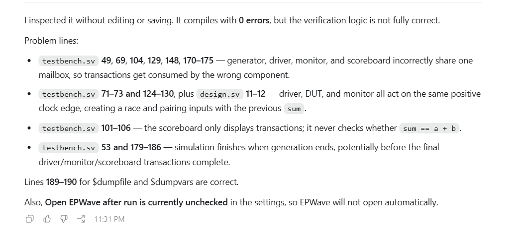
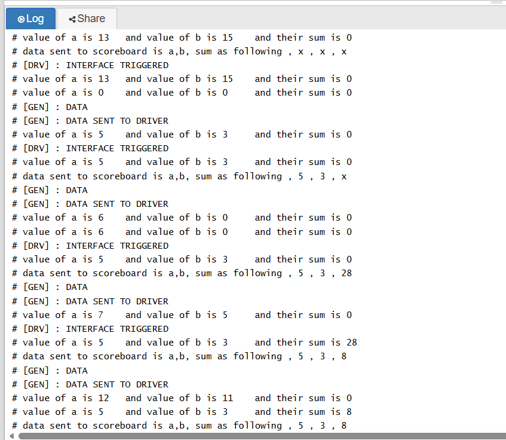
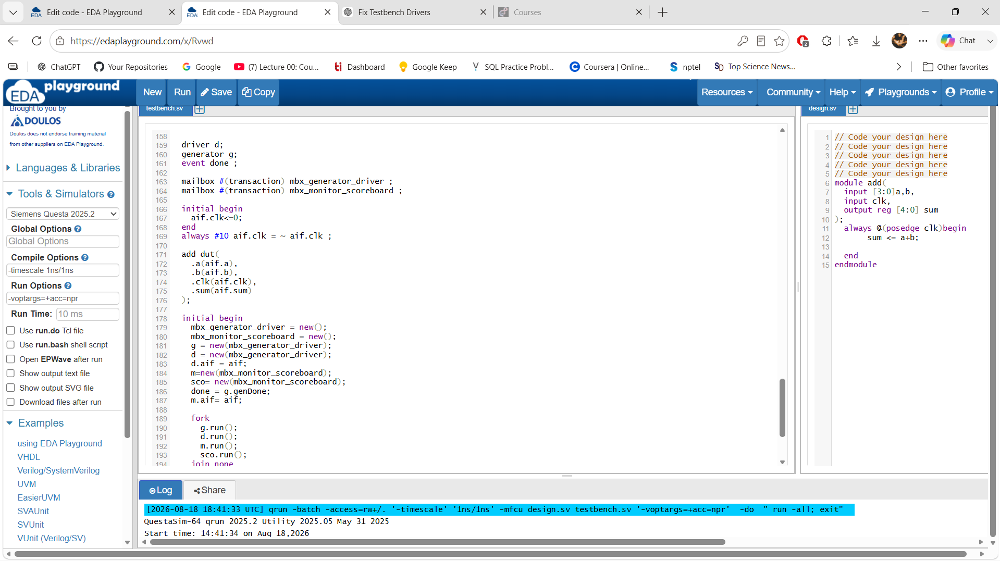

# Part 44 — Monitor and Scoreboard with Separate Mailboxes

[← Part 43](../43-polymorphic-copy-error-injection/README.md) · [Learning index](../README.md) · Next part not captured yet

| Saved-playground field | Value |
|---|---|
| EDA Playground Name | `all the screenshots, to be attached`; repository title: `SV 44 - Monitor and Scoreboard with Separate Mailboxes` |
| Stable playground | [Rvwd](https://edaplayground.com/x/Rvwd) |
| Saved code ID | `7366164` |
| Simulator | Siemens Questa 2025.2 |
| Compile / run options | `-timescale 1ns/1ns` / `-voptargs=+acc=npr` |
| Open EPWave after run | Unchecked |
| Verified live result | **Compiles, but verification is not fully drained:** 16 generator sends, 15 driver actions, 16 monitor samples, and 8 scoreboard comparisons before finish at 320 ns |

This lesson comes after the working polymorphic-copy experiment in Part 43. It adds a monitor and scoreboard to the adder environment, records the first incorrect integration, and then preserves the corrected two-mailbox version. The screenshots are included as learning evidence, not merely linked.

## Stage 1 — The code immediately before this playground

The preceding playground is [Part 43 — Polymorphic Copy for Error Injection](../43-polymorphic-copy-error-injection/README.md). Its complete testbench is rendered here as requested so the progression can be read without leaving this page.

~~~systemverilog
// Code your testbench here
// or browse Examples
//To inject error form generator class to driver and hence dut
//DEEP COPY OF A TRANSACTION
/*
1) independent object
2) capability to inject an error form gen to driver */
class transaction ;
  randc bit [3:0] a;
  randc bit [3:0] b;
  bit [4:0] sum;
  function void display();
    $display("value of a is %0d \t and value of b is %0d \t and their sum is %0d " , a,b, sum );
    endfunction
  virtual function transaction copy ();  // making a new handle of type transaction
    copy=new();                  //copying the current objects attributes to that handle
    copy.a= this.a;
    copy.b=this.b;
    copy.sum=this.sum;
  endfunction  // value is getting generated but the copy is sending 0 to the object handle
endclass
//inject the error
class error extends transaction ;
  //constraint data_c {a ==0 ; b==0; }
   function transaction copy ();  // making a new handle of type transaction
    copy=new();                  //copying the current objects attributes to that handle
    copy.a= 0;
    copy.b=0;
    copy.sum=this.sum;
   endfunction
endclass

class generator;
  transaction t;
  mailbox #(transaction) mbx;
  event genDone ;
  //CONSTRUCTOR FOR GENERATOR
  function new (mailbox #(transaction) mbx) ;
    this.mbx=mbx; //
    t=new(); //single space so randc can remember its history and we can get intended behaviour
  endfunction

  task run();
    //t=new();//single object

    for(int i =0 ; i<16;i++ )begin
      //t=new(); // we need  a deep copy INDEPENDENT SPACE OBJECT

      assert(t.randomize()) else $display("Randomization failed ");
      $display("[GEN] : DATA SENT TO DRIVER ");
      t.display();
      mbx.put(t.copy);  //im not sending the real transaction obj instead im sending the copy
      #20;
      $display("[GEN] : DATA ");
    end
     ->genDone;
    endtask
endclass

class driver;
  virtual add_interface.DRV aif;
  mailbox #(transaction) mbx;
  transaction container;
  event next ;
  function new(mailbox #(transaction) mbx);
    this.mbx=mbx;

  endfunction

   task run();
   forever begin
     mbx.get(container); // transaction type container

     @(posedge aif.clk);
     aif.a=container.a;
     aif.b=container.b;
     $display("[DRV] : INTERFACE TRIGGERED ");
     container.display();  // display the value received form the mailbox
     ->next; // event triggered next ;

    end
   endtask
endclass

module tb;
  add_interface aif();
  error err;

  driver d;
  generator g;
  event done ;

  mailbox #(transaction) mbx;
  initial begin
    aif.clk<=0;
  end
  always #10 aif.clk = ~ aif.clk ;

  add dut(
    .a(aif.a),
    .b(aif.b),
    .clk(aif.clk),
    .sum(aif.sum)
  );

  initial begin
    mbx=new();
    g=new(mbx); // TRANSACTION OJBECT will be created here, this will be removed
    d=new(mbx);
    err=new();

    g.t=err; // will send an error injecting of error

    d.aif=aif ; // what is the use of this
    done = g.genDone ;
  end
  initial begin
    fork
      g.run();
      d.run();

    join_none //non blocking
    wait(done.triggered);
    $finish();
  end
  initial begin
    $dumpfile("dump.vcd");
    $dumpvars;

  end
  /*
  initial begin
    #400;
    $finish();

  end
  */
endmodule

interface add_interface;
  logic [3:0] a ; //equivalent logic type defined in interface
  logic [3:0] b;
  logic [4:0] sum;
  logic clk ;
  modport DRV (output a,b,input sum, clk );// A AND B will have o/p direction rest all r inputs

endinterface
~~~

Part 43 has only one producer-consumer path: generator → mailbox → driver. Part 44 introduces a second, independent path: monitor → mailbox → scoreboard. That architectural change is exactly why one mailbox can no longer safely serve every component.

## Stage 2 — The first monitor/scoreboard attempt and its diagnosis

The screenshot correctly separates compilation from verification. The first attempt compiled with 0 errors, but four functional problems remained:

| Problem | Why it is wrong |
|---|---|
| One mailbox shared by generator, driver, monitor, and scoreboard | `driver` and `scoreboard` become competing consumers. Either can remove the next object, regardless of who produced it. |
| Driver, DUT, and monitor all use `posedge clk` | Their ordering is not a valid sampling protocol. The DUT uses a nonblocking assignment, so `sum` updates in the NBA region after active-region code. |
| Scoreboard only calls `display()` | Printing a transaction does not check `sum == a + b`. |
| Top waits only for `genDone` | Generation can finish while items are still waiting to be driven, monitored, or checked. |

The screenshot also notes that **Open EPWave after run** is unchecked. This does not change functional simulation, but it means the waveform will not open automatically.

### Important distinction about the pasted transitional text

The text pasted into this task contains a dangling declaration, `mailbox #(transaction) mbx_`, while the constructor calls still use `mbx`. If compiled literally, that mid-edit text has a syntax/name error. The 0-error behavioral run in the screenshots came from the immediately preceding syntactically complete version with one shared `mailbox #(transaction) mbx`. That behaviorally faulty but compilable version is preserved below and in [faulty-single-mailbox-testbench.sv](faulty-single-mailbox-testbench.sv).

### Faulty single-mailbox source

~~~systemverilog
// Code your testbench here
// or browse Examples
// Code your testbench here
// or browse Examples
//To inject error form generator class to driver and hence dut
//DEEP COPY OF A TRANSACTION
/*
1) independent object
2) capability to inject an error form gen to driver */
class transaction ;
  randc bit [3:0] a;
  randc bit [3:0] b;
  bit [4:0] sum;
  function void display();
    $display("value of a is %0d \t and value of b is %0d \t and their sum is %0d " , a,b, sum );
    endfunction
  function transaction copy();
    copy = new();
    copy.a = this.a;
    copy.b = this.b;
    copy.sum = this.sum;
    endfunction

endclass
//inject the error

class generator;
  transaction t;
  mailbox #(transaction) mbx;
  event genDone ;
  //CONSTRUCTOR FOR GENERATOR
  function new (mailbox #(transaction) mbx_generator_driver) ;
    this.mbx=mbx_generator_driver; //
    t=new(); //single space so randc can remember its history and we can get intended behaviour
  endfunction

  task run();
    //t=new();//single object

    for(int i =0 ; i<16;i++ )begin
      //t=new(); // we need  a deep copy INDEPENDENT SPACE OBJECT

      assert(t.randomize()) else $display("Randomization failed ");
      $display("[GEN] : DATA SENT TO DRIVER ");
      t.display();
      mbx.put(t.copy);  // send an independent transaction snapshot
      #20;
      $display("[GEN] : DATA ");
    end
     ->genDone;
    endtask
endclass

class driver;
  virtual add_interface.DRV aif;
  mailbox #(transaction) mbx;
  transaction container;
  event next ;
  function new(mailbox #(transaction) mbx_generator_driver);
    this.mbx=mbx_generator_driver;

  endfunction

   task run();
   forever begin
     mbx.get(container); // transaction type container

     @(posedge aif.clk);
     aif.a=container.a;
     aif.b=container.b;
     $display("[DRV] : INTERFACE TRIGGERED ");
     container.display();  // display the value received form the mailbox
     ->next; // event triggered next ;

    end
   endtask
endclass

interface add_interface;
  logic [3:0] a ; //equivalent logic type defined in interface
  logic [3:0] b;
  logic [4:0] sum;
  logic clk ;
  modport DRV (output a,b,input sum, clk );// A AND B will have o/p direction rest all r inputs

endinterface

class scoreboard;
  transaction trans;
  mailbox #(transaction) mbx; // to send from monitor to scoreboard
  function new( mailbox #(transaction) mbx_monitor_scoreboard);
    this.mbx=mbx_monitor_scoreboard;
  endfunction
  task run();
    forever begin

      mbx.get(trans);
      trans.display();
      #40;
    end

  endtask

endclass

class monitor;
  virtual add_interface aif;
  mailbox #(transaction) mbx; // to send from monitor to scoreboard
  transaction trans;
  function new( mailbox #(transaction) mbx_monitor_scoreboard);
    this.mbx=mbx_monitor_scoreboard;
  endfunction

  task run();
    forever begin
      @(posedge aif.clk);
      trans= new(); // cause i want a new transaction object each time a task is called
      trans.a = aif.a;   // from interface to transaction
      trans.b =aif.b;
      trans.sum =aif.sum;
      mbx.put(trans); // after the response from teh dut i put the transaction into the mailbox
      $display("data sent to scoreboard is a,b, sum as following , %0d , %0d , %0d " , aif.a , aif.b , aif.sum);

    end
  endtask
endclass

module tb;
  add_interface aif();

  monitor m;
  scoreboard sco;

  driver d;
  generator g;
  event done ;

  mailbox #(transaction) mbx;

  initial begin
    aif.clk<=0;
  end
  always #10 aif.clk = ~ aif.clk ;

  add dut(
    .a(aif.a),
    .b(aif.b),
    .clk(aif.clk),
    .sum(aif.sum)
  );

  initial begin
    mbx = new();
    g = new(mbx);
    d = new(mbx);
    d.aif = aif;
    m=new(mbx);
    sco= new(mbx);
    done = g.genDone;
    m.aif= aif;

    fork
      g.run();
      d.run();
      m.run();
      sco.run();
    join_none
    wait(done.triggered);
    $finish();
  end
  initial begin
    $dumpfile("dump.vcd");
    $dumpvars;

  end

endmodule
~~~

## What the faulty log proves

The log is not just untidy output; it exposes broken data ownership.

- The generator prints `a=13, b=15`.
- A monitor message initially reports unknown values (`x`), because sampling occurs before a stable DUT response is guaranteed.
- The driver and scoreboard do not receive a strict one-to-one sequence because both call `get()` on the same mailbox.
- Later, `sum=28` appears beside `a=5, b=3` in nearby output. Twenty-eight belongs to the earlier `13+15` transaction, which demonstrates stale response pairing rather than a correct current comparison.

A SystemVerilog mailbox is a queue, not a broadcast channel. A `get()` removes one item. When two unrelated consumers share the same mailbox, the item does not go to both; whichever consumer executes `get()` first wins it.

## Stage 3 — How I solved the main errors

The corrected playground makes three direct architectural repairs:

| Before | After | Effect |
|---|---|---|
| One `mbx` for all four components | `mbx_generator_driver` and `mbx_monitor_scoreboard` | Generator traffic can only reach the driver; monitor traffic can only reach the scoreboard. |
| Driver, DUT, and monitor all react on the positive edge | Driver drives on `negedge`; DUT samples on `posedge`; monitor waits `#1` after that positive edge | Inputs settle for half a cycle, and the monitor samples after the DUT's nonblocking `sum` update. |
| Scoreboard only displays | `compare(trans)` checks `trans.sum == trans.a + trans.b` | A received result now produces either `sum result matches` or `$error("Result mismatches")`. |

The monitor also allocates `trans = new()` for every sample, so each mailbox entry is an independent observed snapshot.

### Corrected saved testbench

~~~systemverilog
// Code your testbench here
// or browse Examples
// Code your testbench here
// or browse Examples
//To inject error form generator class to driver and hence dut
//DEEP COPY OF A TRANSACTION
/*
1) independent object
2) capability to inject an error form gen to driver */
// IT WORKED YAYYYYYYYYYYYYYYYYYYYYYYYYYYYYYYYYYYY

class transaction ;
  randc bit [3:0] a;
  randc bit [3:0] b;
  bit [4:0] sum;
  function void display();
    $display("value of a is %0d \t and value of b is %0d \t and their sum is %0d " , a,b, sum );
    endfunction
  function transaction copy();
    copy = new();
    copy.a = this.a;
    copy.b = this.b;
    copy.sum = this.sum;
    endfunction

endclass
//inject the error

class generator;
  transaction t;
  mailbox #(transaction) mbx;
  event genDone ;
  //CONSTRUCTOR FOR GENERATOR
  function new (mailbox #(transaction) mbx_generator_driver) ;
    this.mbx=mbx_generator_driver; //
    t=new(); //single space so randc can remember its history and we can get intended behaviour
  endfunction

  task run();
    //t=new();//single object

    for(int i =0 ; i<16;i++ )begin
      //t=new(); // we need  a deep copy INDEPENDENT SPACE OBJECT

      assert(t.randomize()) else $display("Randomization failed ");
      $display("[GEN] : DATA SENT TO DRIVER ");
      t.display();
      mbx.put(t.copy);  // send an independent transaction snapshot
      #20;
      $display("[GEN] : DATA ");
    end
     ->genDone;
    endtask
endclass

class driver;
  virtual add_interface.DRV aif;
  mailbox #(transaction) mbx;
  transaction container;
  event next ;
  function new(mailbox #(transaction) mbx_generator_driver);
    this.mbx=mbx_generator_driver;

  endfunction

   task run();
   forever begin
     mbx.get(container); // transaction type container

     @(negedge aif.clk);
     aif.a=container.a;
     aif.b=container.b;
     $display("[DRV] : INTERFACE TRIGGERED ");
     container.display();  // display the value received form the mailbox
     ->next; // event triggered next ;

    end
   endtask
endclass

interface add_interface;
  logic [3:0] a ; //equivalent logic type defined in interface
  logic [3:0] b;
  logic [4:0] sum;
  logic clk ;
  modport DRV (output a,b,input sum, clk );// A AND B will have o/p direction rest all r inputs

endinterface

class scoreboard;
  transaction trans;
  mailbox #(transaction) mbx; // to send from monitor to scoreboard
  function new( mailbox #(transaction) mbx_monitor_scoreboard);
    this.mbx=mbx_monitor_scoreboard;
  endfunction
  task run();
    forever begin

      mbx.get(trans);
      trans.display();
      compare(trans);

      #40;
    end

  endtask

  task compare(input transaction trans);
    if((trans.sum) == (trans.a + trans.b ))begin
      $display("sum result matches") ;
    end else begin
      $error("Result mismatches ");
    end
  endtask

endclass

class monitor;
  virtual add_interface aif;
  mailbox #(transaction) mbx; // to send from monitor to scoreboard
  transaction trans;
  function new( mailbox #(transaction) mbx_monitor_scoreboard);
    this.mbx=mbx_monitor_scoreboard;
  endfunction

  task run();
    @(negedge aif.clk);
    forever begin
      @(posedge aif.clk);
      #1;
      trans= new(); // cause i want a new transaction object each time a task is called
      trans.a = aif.a;   // from interface to transaction
      trans.b =aif.b;
      trans.sum =aif.sum;
      mbx.put(trans); // after the response from teh dut i put the transaction into the mailbox
      $display("data sent to scoreboard is a,b, sum as following , %0d , %0d , %0d " , aif.a , aif.b , aif.sum);

    end
  endtask
endclass

module tb;
  add_interface aif();

  monitor m;
  scoreboard sco;

  driver d;
  generator g;
  event done ;

  mailbox #(transaction) mbx_generator_driver ;
  mailbox #(transaction) mbx_monitor_scoreboard ;

  initial begin
    aif.clk<=0;
  end
  always #10 aif.clk = ~ aif.clk ;

  add dut(
    .a(aif.a),
    .b(aif.b),
    .clk(aif.clk),
    .sum(aif.sum)
  );

  initial begin
    mbx_generator_driver = new();
    mbx_monitor_scoreboard = new();
    g = new(mbx_generator_driver);
    d = new(mbx_generator_driver);
    d.aif = aif;
    m=new(mbx_monitor_scoreboard);
    sco= new(mbx_monitor_scoreboard);
    done = g.genDone;
    m.aif= aif;

    fork
      g.run();
      d.run();
      m.run();
      sco.run();
    join_none
    wait(done.triggered);
    $finish();
  end
  initial begin
    $dumpfile("dump.vcd");
    $dumpvars;

  end

endmodule
~~~

### DUT design

~~~systemverilog
// Code your design here
// Code your design here
// Code your design here
// Code your design here
// Code your design here
module add(
  input [3:0]a,b,
  input clk,
  output reg [4:0] sum
);
  always @(posedge clk)begin
       sum <= a+b;

  end
endmodule
~~~

## Timing of the corrected sampling path

~~~text
negedge clk       driver changes a and b
      │
      ▼
posedge clk       DUT evaluates a+b and schedules sum <= a+b
      │
      ▼
NBA region        sum receives the new value
      │
      ▼
posedge + 1 ns    monitor copies a, b, and updated sum
      │
      ▼
monitor mailbox   scoreboard receives and compares the snapshot
~~~

The `#1` is intentionally placed after the positive edge so the monitor runs after the DUT's NBA update. It is a simple teaching fix. A more reusable environment would use a clocking block with explicit input skew instead of embedding a literal delay.

## Questions from the corrected code, explained

### Why does the monitor execute `trans = new()` for every sample?

**Reason recorded in the source**

> `trans= new(); // cause i want a new transaction object each time a task is called`

The comment has the right object-identity idea, with one wording correction: `run()` is called once and its `forever` loop performs many samples. The `new()` therefore creates one transaction per loop iteration, not one per task call. Each mailbox entry then remains an independent snapshot. If the monitor reused one object and repeatedly put the same handle, queued scoreboard entries could all alias an object that the monitor later overwrites.

### Why is a copy method not required on the monitor-to-scoreboard path here?

The monitor has already allocated a fresh transaction for the current sample and does not mutate it after `mbx.put(trans)`. Passing that fresh handle is safe for this simple ownership pattern. A clone would become useful if the monitor reused or modified the object after putting it, or if multiple consumers needed independent ownership.

Also, the transaction currently contains only scalar bit vectors. The source's “deep copy” label should therefore be read as “new independent transaction snapshot”; no nested class handle exists here to prove recursive deep-copy behavior. If one is added later, allocating a fresh outer transaction alone will not make that nested state independent.

### Why use `negedge` in the driver and `posedge` plus `#1` in the monitor?

The negative-edge drive gives `a` and `b` half a clock period to settle before the DUT's positive-edge calculation. The DUT assigns `sum` nonblockingly, so the additional `#1` lets the NBA update complete before sampling. This resolves the stale/unknown sum race shown in the faulty log, although a clocking block is the cleaner long-term mechanism.

## Verified rerun: what is fixed and what is still left

The refreshed `Rvwd` playground reran successfully with 0 simulation errors and no `Result mismatches` messages. However, counting the live log gives:

| Stage | Count |
|---|---:|
| `[GEN] : DATA SENT TO DRIVER` | 16 |
| `[DRV] : INTERFACE TRIGGERED` | 15 |
| Monitor `data sent to scoreboard` messages | 16 |
| `sum result matches` comparisons | 8 |
| `Result mismatches` | 0 |
| Finish time | 320 ns |

Therefore the main routing, sampling, and comparison errors were solved, but the complete verification objective is **not finished yet**.

### Why only eight results are checked

The scoreboard waits `#40` after every comparison, while the monitor produces a sample every 20 ns. The monitor-to-scoreboard mailbox accumulates pending items, and only eight are removed before the top ends the simulation.

### Why 16 samples do not mean 16 uniquely driven transactions

The live log contains 16 monitor samples but only 15 driver actions. Startup edge ordering and the lack of an explicit valid/acknowledgement protocol allow one input state to be sampled more than once. A passing arithmetic comparison only proves that the sampled `sum` matches the sampled `a` and `b`; it does not prove one-to-one coverage of every generated transaction.

### Why `genDone` is too early for `$finish`

`genDone` means the generator completed its loop. It does not mean:

- the driver consumed the final generator item;
- the DUT evaluated the final driven inputs;
- the monitor captured the final response;
- the scoreboard checked every expected response.

The top-level `wait(done.triggered); $finish();` can therefore terminate a still-active pipeline.

## The next robust completion fix

A complete next revision should:

1. remove the scoreboard's artificial `#40` delay, or replace it with protocol-driven pacing;
2. count checked transactions in the scoreboard;
3. trigger an `all_checked` event after the expected 16 comparisons;
4. make the top wait for `all_checked.triggered` rather than `genDone`;
5. add a valid/acknowledgement mechanism so the monitor samples exactly once per driven transaction;
6. optionally use a clocking block to define drive and sample skew;
7. enable EPWave only when a waveform is required.

A minimal completion condition would look like this:

~~~systemverilog
int checked_count;
event all_checked;

task compare(input transaction trans);
  if (trans.sum == (trans.a + trans.b))
    $display("sum result matches");
  else
    $error("Result mismatches");

  checked_count++;
  if (checked_count == 16)
    ->all_checked;
endtask
~~~

The top would then wait for the scoreboard's completion event. This must be paired with one monitor sample per valid driven transaction; a counter alone cannot repair duplicated observations.

## Points to remember

- Use one mailbox per directed producer-consumer channel.
- `mailbox.get()` consumes an item; it does not broadcast it.
- Drive before the DUT's sampling edge and sample after the DUT response update.
- A scoreboard must compare, not merely print.
- “0 errors” from the compiler does not prove the verification architecture is correct.
- “0 mismatches” is meaningful only when every intended transaction was actually checked.
- End the test on verification completion, not stimulus-generation completion.
- Keep screenshots, faulty code, corrected code, and run evidence together so the debugging path remains reproducible.

## References

[IEEE 1800-2023 SystemVerilog standard](https://standards.ieee.org/ieee/1800/7743/) · [Accellera mailbox and class material](https://www.accellera.org/images/eda/sv-ec/att-0051/01-sv3.1_donation_VeraLite.pdf) · [Accellera SystemVerilog interfaces paper](https://www.accellera.org/images/eda/sv-bc/att-10226/Interfaces_Future.pdf)
